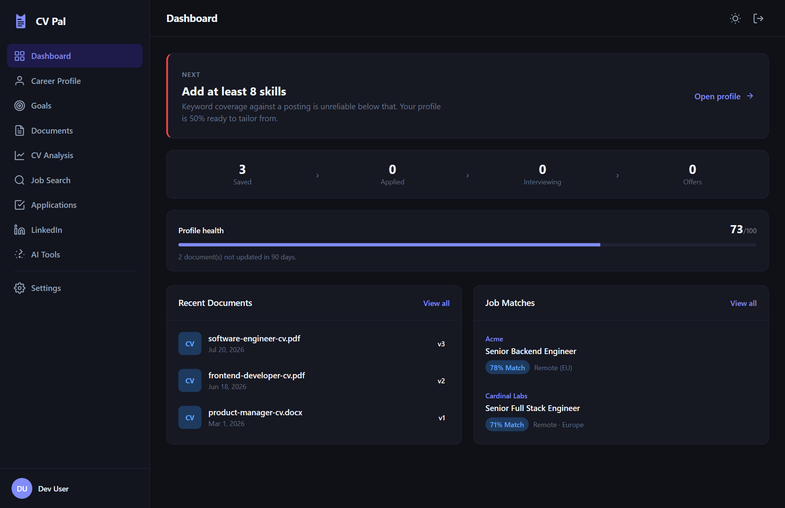
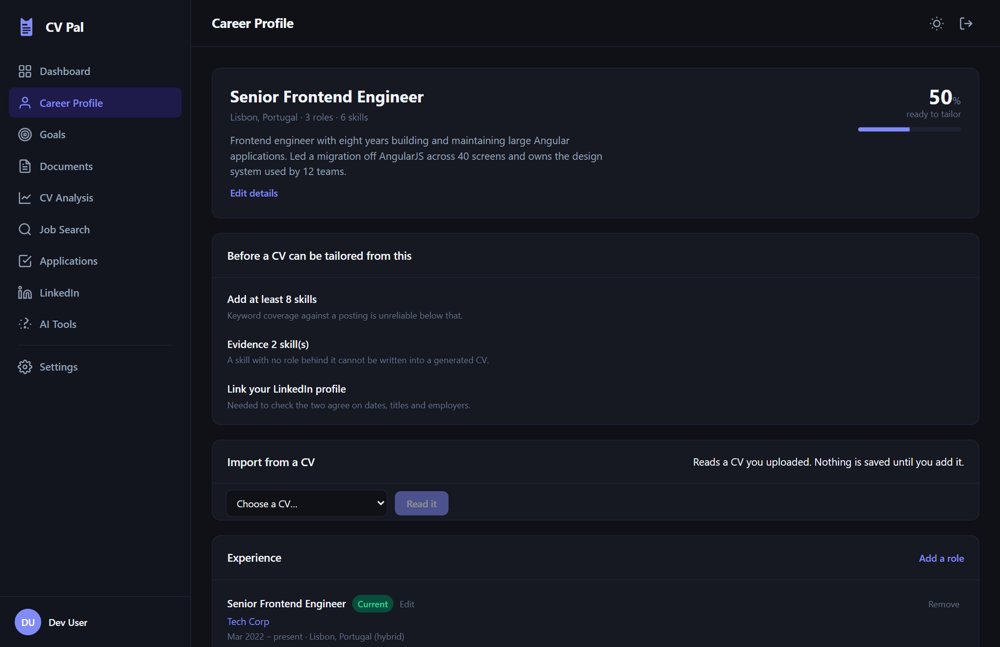
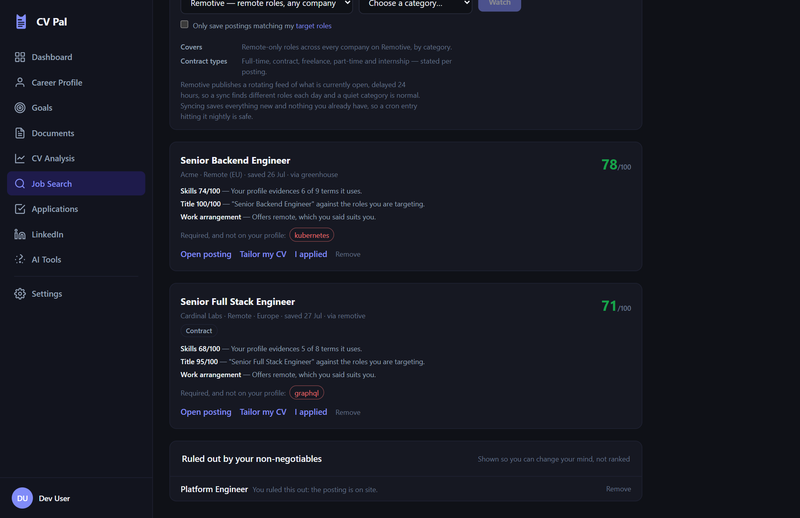

# CV Pal

**Keep your CV competitive against AI screening — without letting it invent your career.**
Hold a structured record of your career, check any CV against a real posting for ATS
parseability and keyword coverage, and generate versions tailored to the postings worth
applying for. Runs entirely on your own machine if you want it to.



## Two guarantees

**It never invents experience.** Every line it writes is grounded in something you
entered. A skill with no role behind it cannot be written into a generated CV, and the
profile screen says so up front rather than letting you find out when the output is thin.



Where a posting wants something you do not have, it says so as a *gap* rather than
quietly adding it. Every match score states its reasons, and a posting ruled out by your
own non-negotiables stays visible instead of silently disappearing.



**It automates the tedium, not the judgement.** The tools in this space advertise
50–100 automated applications a day. This one will not, because *applications sent* is
the number you can watch move, not the one you want. Automated submission is not built
yet; when it is, nothing will go out without you seeing it first. The rules are written
down in [PLANNING](docs/PLANNING.md) before any of it ships.

## Run it yourself

**Windows:** clone the repository and double-click **`start-cv-pal.cmd`**. It starts
Docker Desktop if it is not already running, generates the secret key on first run,
checks your local model, and opens the app when it is ready.

**Any platform:**

```bash
git clone https://github.com/Jesusw0w/cv-pal.git && cd cv-pal
cp .env.docker.example .env          # then set CV_PAL_SECRET_KEY
docker compose --profile ollama up -d
```

Open <http://localhost:8080>. That pulls prebuilt images from ghcr.io rather than
building; to build from the working tree instead, add
`-f docker-compose.yml -f docker-compose.build.yml`. Full walkthrough, including
backups and troubleshooting: **[docs/self-hosting.md](docs/self-hosting.md)**.

Already running Ollama on the machine? Drop the `--profile ollama` and set
`CV_PAL_LLM_BASE_URL=http://host.docker.internal:11434/v1` — it uses your GPU and the
models you have already pulled, instead of downloading them again into a container.

Just want to look at the UI? No backend needed:

```bash
cd frontend/cv-pal && npm install && npm run start:mock
```

## Why local-first

Your CV is one of the most sensitive documents you own: employment history, contact
details, often your address and date of birth. CV Pal is **software you run**, not a
service someone else hosts — there is no account on anyone else's server.

You choose the model that powers the AI parts: a local one via
[Ollama](https://ollama.com), so nothing leaves your machine, or a hosted provider with
your own key. Set `CV_PAL_LOCAL_ONLY=true` and it will refuse to contact a hosted
provider at all.

By default the app listens only on `127.0.0.1` — your machine, not your network.

## Status

Early, and honest about it.

| Works | Not built yet |
| --- | --- |
| Accounts: sign-in, sessions held in HttpOnly cookies, change password, edit your name, export your data, delete everything | The application quality gate — the checks that must pass before anything is sent |
| A guided first run: upload a CV, keep what it read correctly, then say what you are looking for | Match rules, an application queue, and automated submission |
| Career profile: roles, education and skills — add, amend, remove, cite the roles that evidence a skill, or import the lot from a CV | Per-account model configuration — it is per deployment, in `.env` |
| A summary drafted from the facts already in your profile, which you read before keeping | Scheduled collection: syncing boards is one call you run, or a cron entry |
| Career goals: target roles, work regime, salary floor, where you can work — and which are non-negotiable | Projects, certifications, and JSON Resume import |
| ATS parseability check and keyword coverage, with no model needed | A skill vocabulary beyond software roles — see [PLANNING](docs/PLANNING.md#known-limitation-the-vocabulary-is-software-specific) |
| AI CV review with accept/reject suggestions, and a clear notice when the model is not available | |
| Job postings: paste one, import a Greenhouse / Lever / Remotive link, or watch boards and sync them | |
| Match scoring against your goals, with the reason for every score | |
| Tailored CVs exported to DOCX / PDF, every line grounded in your profile | |
| Cover-letter drafts, checked against your own recent letters so they cannot all be the same one | |
| Application tracking with reply rate and a list of who to chase | |
| LinkedIn import — print-to-PDF, the official export, or paste — with a section-by-section review | |
| Local or hosted models: Ollama, OpenAI, Anthropic, or any OpenAI-compatible endpoint | |

Current state and what is next: [docs/PROGRESS.md](docs/PROGRESS.md).

## Architecture at a glance

```
frontend/cv-pal   Angular 22. One HTTP boundary, which mock mode intercepts —
                  the same seam that will allow a serverless build later.
        │  /api   (nginx proxies to the backend, so it is all one origin)
        ▼
backend/cv_pal
  routers/        HTTP edge: validation and response shaping only
  services/       business logic — framework-free, unit-testable
  analysis/       the deterministic core: keywords, parseability, matching, similarity
  generation/     tailored CV and letter assembly; Markdown, DOCX and PDF renderers
  integrations/   job boards, behind one Protocol
  llm.py          provider-agnostic model client (OpenAI, Anthropic, Ollama, compatible)
  models.py       SQLAlchemy 2.0        schemas.py   Pydantic v2
  alembic/        migrations own the schema; never create_all()
```

Deterministic first: keyword coverage, parseability, skill overlap and scoring are
*computed*. The model is used for judgement and phrasing only — which keeps results
reproducible, cheap, and testable.

Design decisions and reasoning: **[docs/PLANNING.md](docs/PLANNING.md)**.

## Documentation

| | |
| --- | --- |
| [Self-hosting](docs/self-hosting.md) | Run it, no development tools needed |
| [Development](docs/development.md) | Set up, run the tests, add a migration |
| [Planning](docs/PLANNING.md) | Product plan, architecture, decisions |
| [Changelog](CHANGELOG.md) | What shipped, per release |
| [Progress](docs/PROGRESS.md) | Current state and what is left |
| [Security](SECURITY.md) | Reporting, and what the software actually does |

## Contributing

Welcome — see [CONTRIBUTING.md](CONTRIBUTING.md). The quality gate is `uv run nox`
(ruff, `mypy --strict`, pytest, and a migration check) plus the frontend tests, and CI
runs the same commands.

## Licence

[MIT](LICENSE).
